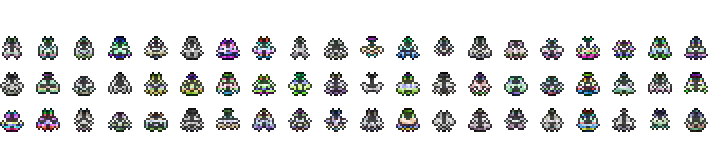
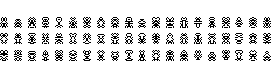
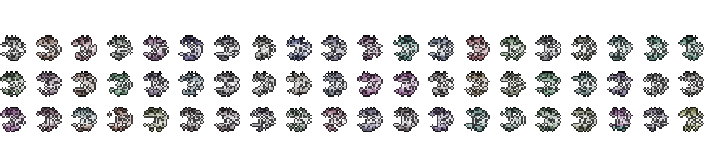
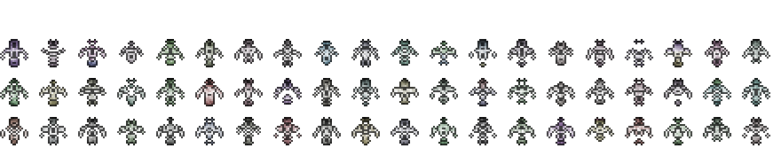

Sprite Generator
======================

A python port of https://github.com/zfedoran/pixel-sprite-generator. It essentially
takes in any template and randomly generates sprites based on the template.   

## Algorithm
The sprites are generated by using a two dimensional mask. The values in the mask are then randomized and mirrored. The resulting template is rendered to a canvas element.

<a href="http://web.archive.org/web/20080228054410/http://www.davebollinger.com/works/pixelspaceships/"></a>

The algorithm is explained in more detail on [Dave Bollinger's](http://web.archive.org/web/20080228054410/http://www.davebollinger.com/works/pixelspaceships/) website.

<a href="http://web.archive.org/web/20080228054410/http://www.davebollinger.com/works/pixelspaceships/"></a>

## Examples
**Spaceships**  


**Robots**  


**Dragons**  


**Dragons Top-Down**  



## Code
```python
from SpriteGenerator import generate_canvas

robot = [[0, 0, 0, 0],
         [0, 1, 1, 1],
         [0, 1, 2, 2],
         [0, 0, 1, 2],
         [0, 0, 0, 2],
         [1, 1, 1, 2],
         [0, 1, 1, 2],
         [0, 0, 0, 2],
         [0, 0, 0, 2],
         [0, 1, 2, 2],
         [1, 1, 0, 0]]

im = generate_canvas(robot, 
                     color_variations=0.2, 
                     brightness_noise=0.3,
                     edge_brightness=0.3, 
                     saturation=0.2, 
                     colored=False, 
                     mirror=True, 
                     n=80,
                     nr_columns=20)
im.resize((im.size[0]*2, im.size[1]*2))
```